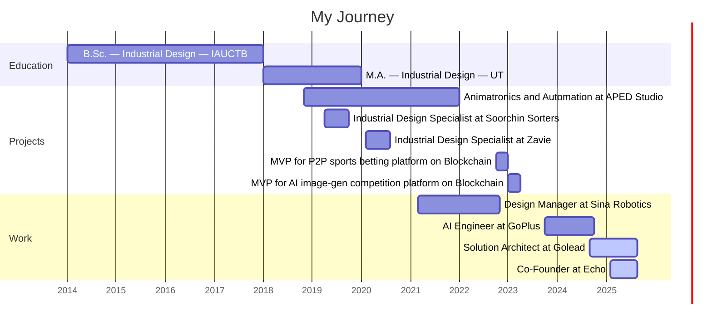

~~~
    ____       __                       
   / __ )___  / /_  ____ _   ______ ___ 
  / __  / _ \/ __ \/ __ \ | / / __ `__ \
 / /_/ /  __/ / / / / / / |/ / / / / / /
/_____/\___/_/ /_/_/ /_/|___/_/ /_/ /_/
~~~

<!--  -->

# Behnam Khorsandian
***Solution Architect specializing in data-driven projects***

<!--

-->
<!--
**behnamkhorsandian/behnamkhorsandian** is a ✨ _special_ ✨ repository because its `README.md` (this file) appears on your GitHub profile.

Here are some ideas to get you started:

- 🔭 I’m currently working on ...
- 🌱 I’m currently learning ...
- 👯 I’m looking to collaborate on ...
- 🤔 I’m looking for help with ...
- 💬 Ask me about ...
- 📫 How to reach me: ...
- 😄 Pronouns: ...
- ⚡ Fun fact: ...
-->
